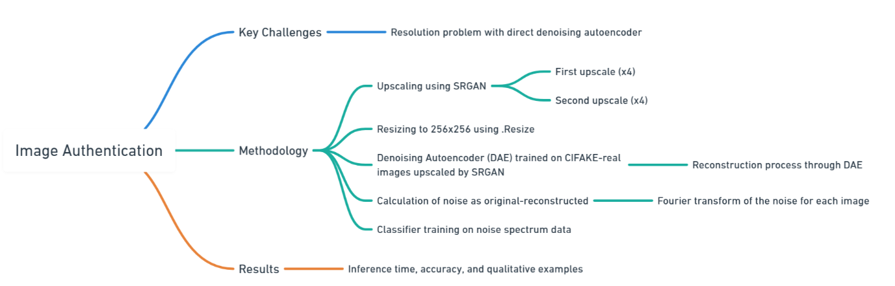

# Cracking the Synthetic Code: Detection and Artifact-Based Explanation of AI-Generated Images 

## Introduction 

The rapid progress of generative AI models, including GANs, diffusion models, and autoregressive architectures, has greatly improved the realism of AI-generated images, impacting industries like journalism, e-commerce, and digital identity verification. While these technologies offer creative and operational advancements, they also raise challenges in distinguishing authentic content from AI-generated fabrications, particularly in areas like media integrity, fraud detection, and digital rights management, where ensuring authenticity is crucial.
* * *

### Flow Chart



## Requrites 

!pip install torch torchvision pillow numpy pandas matplotlib scikit-learn diffusers 
!pip install torch
!pip install opencv-python
!pip install transformers[torch]
!pip install diffusers PIL
!pip install accelerate
!pip install --upgrade transformers
!pip install transformers_stream_generator


## How to Run 
1. Change Directory Names
   * Chnage the dir names in the task1.ipynb You find the weight over folder Name in the jupyter file.
   * the folders task1 task2

2. Run the models.py File 
    * Execute the following command: 
    ```  
    python3 models.py
      ````
    in task1 folder
      ```
      run task1.ipynb
      ```


3. Add Input Image Directory
     * Add the input image directory name in the task1.ipynb file. Then, run the file: 
 After execution, you will find a list of fake images in the specified directory.
 
4. Update Directory in task2.ipynb
   Change the directory name in the `task2.ipynb`

      in task2 folder
      ```
      run task2.ipynb
      ``` 
